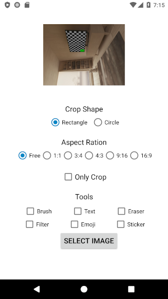
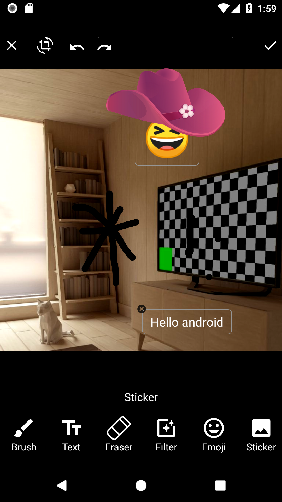

# Image Editor - Edit and Crop image easily
A Image Editor library with simple, easy support for image editing using Paints, Text, Filters, Emoji and Sticker and crop images with rectangle and oval shape.

  

# Featues

- Drawing on image with option to change its Brush's Color, Size, Opacity and Erasing.
- Apply Filter Effect on image using MediaEffect.
- Adding/Editing Text with option to change its Color with Custom Fonts.
- Adding Emoji with Custom Emoji Fonts.
- Adding Images/Stickers.
- Pinch to Scale and Rotate views.
- Undo and Redo for Brush and Views.
- Image rotation while croping.
- Crope image in rectangle and oval shape.
- Crope image with multiple aspect ration like 1:1, 3:4, 9:16 and custom.
- Save image after editing on given path.


Download
--------

Grab via Maven:
```xml
<dependency>
  <groupId>com.hb.imageeditor</groupId>
  <artifactId>camview</artifactId>
  <version>1.0</version>
  <type>pom</type>
</dependency>
```
or Gradle:
```groovy
implementation 'com.github.hbdevmdm:ImageEditor:1.0'
```

# How it works?
  ```java
  //Build camera config object by providing customization
  val builder = ImageEditorBuilder(this@MainActivity, ImageEditorActivity::class.java)
            .setImageUri(imageUri = imageUri.toString()) // Set image uri
            .setOutputPath(getOutputImageFilePath()) // Set output path
            .openOnlyImageCropper(cbOnlyCrop.isChecked) // If true, then it will open only image cropper view
            .setCropShape(BaseActivity.CROP_SHAPE_RECT) // Set rectangle or oval crop shape for cropping.
            .setImageEditorTools(arraylistof()) //Add tools which you want to show on image editor. Empty list will show all tools.
            .setStickerImages(arrayListOf(R.drawable.aa, R.drawable.bb)) // Add sticker images
            .build()

startActivityForResult(
                builder
                , REQUEST_CROP
            )
```

  - and override onActivityResult on Activity/Fragment and write following

```java
  override fun onActivityResult(requestCode: Int, resultCode: Int, data: Intent?) {
        super.onActivityResult(requestCode, resultCode, data)
         if(requestCode==REQUEST_CROP) {
           imageView.setImageURI(data?.getParcelableExtra<Uri>("URI"))
        }
    }
```


# License

```
Copyright 2017 HiddenBrains

Licensed under the Apache License, Version 2.0 (the "License");
you may not use this file except in compliance with the License.
You may obtain a copy of the License at

   http://www.apache.org/licenses/LICENSE-2.0

Unless required by applicable law or agreed to in writing, software
distributed under the License is distributed on an "AS IS" BASIS,
WITHOUT WARRANTIES OR CONDITIONS OF ANY KIND, either express or implied.
See the License for the specific language governing permissions and
limitations under the License.
